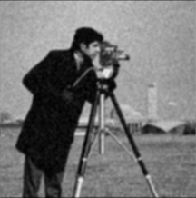
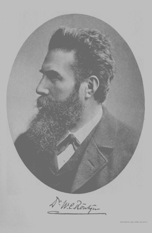
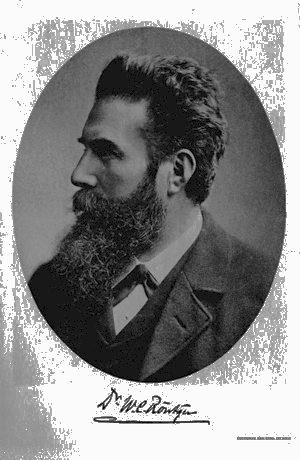
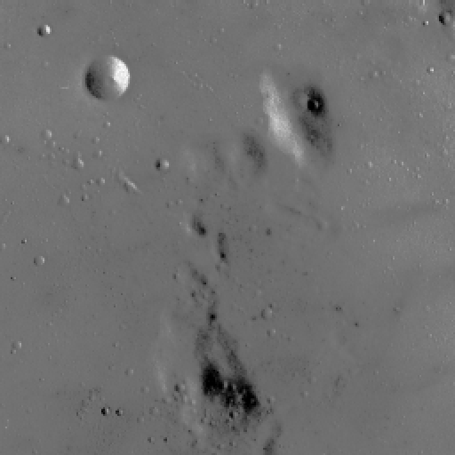
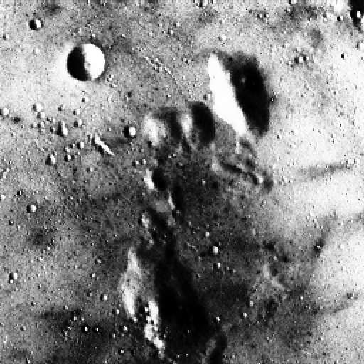

# GPUImageEnhancement
This repository contains the following Image Enhancement Algorithms implemented in NVIDIA's CUDA API:
- Image Brightening/Darkening
- Image Contrast Enhancement:
    - Histogram Streching
    - Histogram Equalization
    - Joint Histogram Equalization (Based on “A Novel Joint Histogram Equalization based Image Contrast Enhancement” published by Sanjay Agrawal, Rutuparna Panda, P.K. Mishro and Ajith Abraham)
- Image Averaging
- Image Grayscaling

## About
I made this project for a case study on Image Processing and Accelerating Parallel Computations using the GPU. Some of the results of the various Image Enhancement Algorithms implemented in this project are given below.

## Image Enhancement Results

### Image Brightness
>  

### Image Averaging (Denoising)
>  

### Image Contrast Enhancement: Histogram Equalization
>  

### Image Contrast Enhancement: Joint Histogram Equalization
>  

