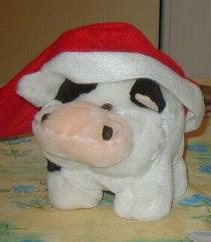
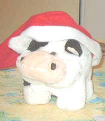

# GPUImageEnhancement
This repository contains the following Image Enhancement Algorithms implemented in NVIDIA's CUDA API:
- Image Brightening/Darkening
- Image Contrast Enhancement:
    - Histogram Streching
    - Histogram Equalization
    - Joint Histogram Equalization (Based on “A Novel Joint Histogram Equalization based Image Contrast Enhancement” published by Sanjay Agrawal, Rutuparna Panda, P.K. Mishro and Ajith Abraham)
- Image Averaging
- Image Grayscaling

## About
I made this project for a case study on Image Processing and Accelerating Parallel Computations using the GPU. Some of the results of the various Image Enhancement Algorithms implemented in this project are given below.

## Image Enhancement Results

### Image Brightness
>  

### Image Averaging (Denoising)
>  

### Image Contrast Enhancement: Histogram Equalization
>  

### Image Contrast Enhancement: Joint Histogram Equalization
>  

## Profiling Results
These are the profiling results done for Image Brightening and Image Averaging showing that some of these algorithms can be used in Real-Time Applications, when keeping a soft deadline of 1 millisecond. However, more of these algorithms can run in Real-Time, for example, the Joint Histogram Equalization currently uses the CPU to calculate the Cumulative Density Function (CDF) for each bin in the generated histogram, which may be done on the GPU using a Parallel Scan.

> 
> 

